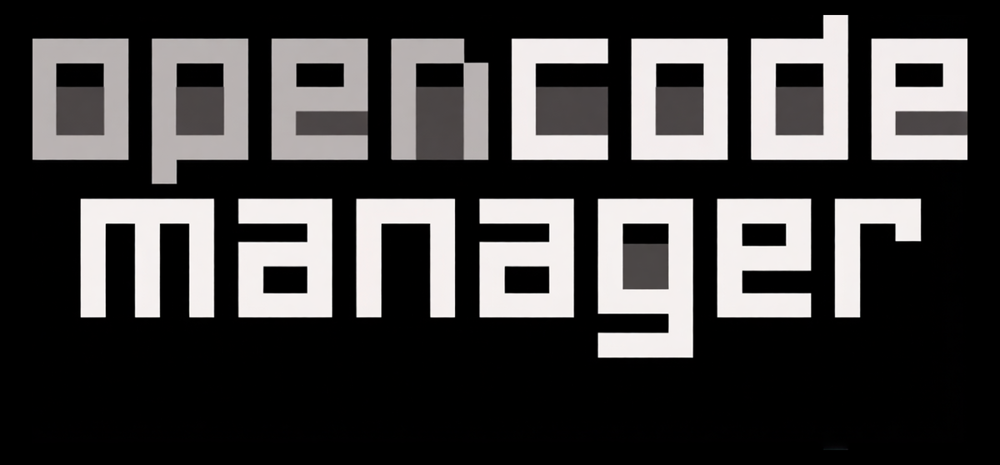

<p align="center">
    
</p>

<p align="center">
    <strong>Multi-agent AI coding platform — manage OpenCode, OpenClaude, and PI agents from one interface.</strong>
</p>

<p align="center">
    <a href="https://github.com/1bitshit/bkg-paf">
        
    </a>
</p>

## What is bkg-paf?

bkg-paf is a mobile-first web interface for managing multiple AI coding agents. Switch between **OpenCode**, **OpenClaude**, and **PI (pi_agent_rust)** backends from a single dashboard. Configure AI providers, manage sessions, and monitor performance — from any device.

## Quick Start

```bash
git clone https://github.com/1bitshit/bkg-paf.git
cd bkg-paf
cp .env.example .env
echo "AUTH_SECRET=$(openssl rand -base64 32)" >> .env
docker-compose up -d
# Open http://localhost:5003
```

On first launch, create your admin account. Done!

## Features

- **Multi-Agent Support** — OpenCode, OpenClaude, and PI (Rust) agents with pluggable adapter pattern
- **Provider Management** — Add, configure, and manage AI providers (OpenAI, Anthropic, NVIDIA NIM, local models)
- **Session Control** — Create, monitor, and abort sessions per agent with real-time health status
- **Repositories & Git** — Multi-repo management, SSH auth, worktrees, diffs, branch/commit management
- **Chat & Sessions** — Real-time SSE streaming, slash commands, `@file` mentions, Plan/Build modes
- **Files** — Directory browser with syntax highlighting, create/rename/delete, ZIP download
- **Schedules** — Recurring repo jobs with reusable prompts, run history, linked sessions
- **MCP Servers** — Add, configure, and manage local or remote MCP servers
- **AI Configuration** — Model/provider setup, API keys, OAuth, custom agent definitions
- **Push Notifications** — Background alerts for agent events, completions, errors
- **Mobile & PWA** — Responsive mobile-first UI, installable on any device

## Agent Backends

| Agent | Type | Description |
|-------|------|-------------|
| **OpenCode** | Server process | Primary AI coding agent with SSE streaming, tools, and MCP support |
| **OpenClaude** | CLI process | Multi-provider agent supporting OpenAI, Gemini, Ollama, and more |
| **PI (Rust)** | CLI process | High-performance agent with 8 built-in tools, RPC mode integration |

## Architecture

```
┌──────────────────────────────────────────────────┐
│              Client (React + Vite)               │
│  Agents · Providers · Sessions · Monitor         │
└──────────────────┬───────────────────────────────┘
                   │ REST API (port 5003)
┌──────────────────▼───────────────────────────────┐
│              Server (Bun + Hono)                 │
│  Agent Registry → Adapter Pattern                │
│  ├── OpenCodeAdapter (port 5551)                 │
│  ├── OpenClaudeAdapter (CLI)                     │
│  └── PiAdapter (pi --mode rpc)                   │
│  Provider Management (file + DB + server merge)  │
│  Settings (SQLite) · Auth · Schedules            │
└──────────────────┬───────────────────────────────┘
                   │
┌──────────────────▼───────────────────────────────┐
│           External Agent CLIs                    │
│  OpenCode · OpenClaude · PI (pi_agent_rust)      │
└──────────────────────────────────────────────────┘
```

## Project Layout

- `client/` — Frontend: React + Vite SPA
- `server/` — Backend: Bun + Hono API server
- `backend/` — Backend source code (Bun + Hono, SQLite, auth, agent adapters)
- `frontend/` — Frontend source code (React + Vite, Tailwind, React Query)
- `shared/` — Shared Zod schemas, types, config helpers
- `docs/` — Documentation

## Configuration

```bash
# Required for production
AUTH_SECRET=your-secure-random-secret  # Generate with: openssl rand -base64 32

# Pre-configured admin (optional)
ADMIN_EMAIL=admin@example.com
ADMIN_PASSWORD=your-secure-password

# For LAN/remote access
AUTH_TRUSTED_ORIGINS=http://localhost:5003,https://yourdomain.com
AUTH_SECURE_COOKIES=false  # Set true when using HTTPS

# PI agent (optional)
PI_API_KEY=your-anthropic-or-openai-key
PI_MODEL=claude-sonnet-4-6
PI_PROVIDER=anthropic
```

## Development

```bash
pnpm install
pnpm dev
pnpm lint
pnpm test
```

## Documentation

- [Features Overview](docs/features/overview.md)
- [Configuration](docs/configuration/environment.md)
- [Troubleshooting](docs/troubleshooting.md)
- [Roadmap](docs/roadmap.md)
- [Implementation Plan](docs/plan.md)

## Future Roadmap

- **Server/Client Split** — Separate repos for backend (private) and frontend (public)
- **bkg-p2p Integration** — CLAW token earning via P2P network participation
- **Voice Coding** — opencode-voice integration for voice-driven sessions
- **Production Hardening** — Monitoring, audit logging, credential rotation

## License

MIT
